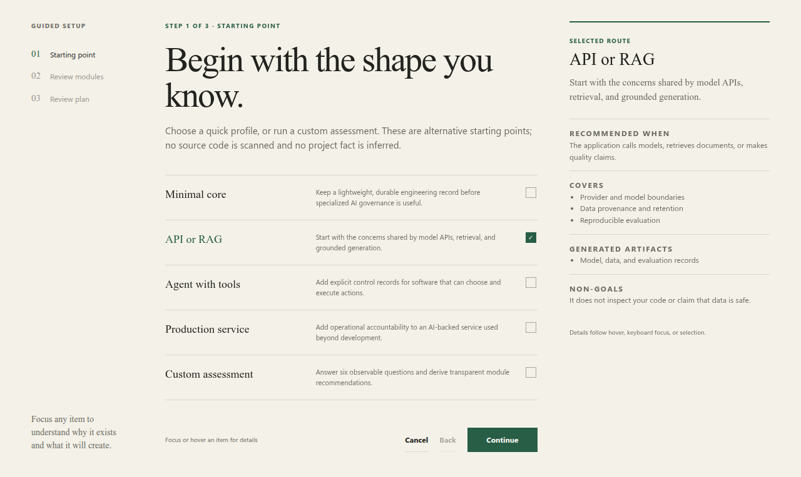

# Applied AI Rig

[](https://github.com/BaptisteBlouin/applied-ai-rig/actions/workflows/ci.yml)
[](https://github.com/BaptisteBlouin/applied-ai-rig/actions/workflows/security.yml)
[](https://pypi.org/project/applied-ai-rig/)
[](LICENSE)

**Make consequential AI changes reviewable by humans and coding agents.**

Applied AI Rig keeps the reason behind a model, dataset, evaluation, tool permission, cost limit, or
fallback in the repository. It connects decisions to evidence and risk-specific records without requiring
a governance platform or imposing an application stack.

Current version: **0.2.0**. See the [changelog](CHANGELOG.md),
[versioning policy](docs/versioning.md), and
[published releases](https://github.com/BaptisteBlouin/applied-ai-rig/releases).

## Contents

- [The problem it solves](#the-problem-it-solves)
- [A concrete example](#a-concrete-example)
- [Fit](#fit)
- [What it generates](#what-it-generates)
- [Quick start](#quick-start)
- [Guided setup](#guided-setup)
- [Structural check](#structural-check)
- [Daily workflow](#daily-workflow)
- [Safe by default](#safe-by-default)
- [Re-running and updating](#re-running-and-updating)
- [Interoperability](#interoperability)
- [Non-goals](#non-goals)
- [Development](#development)

## The problem it solves

An AI-enabled application can keep working while its engineering context disappears: why a model was
selected, which evaluation justified a threshold, where data may go, who approved a side effect, what a
fallback costs, or which result would reverse a decision. Chat history and agent context are not durable
project memory.

Applied AI Rig installs a small review path for that context:

```text
decision -> evidence -> model/data/evaluation/action/operation record -> canonical detail
```

The detailed trace can remain in an experiment tracker, billing system, observability tool, or incident
system. The repository retains only the safe evidence needed to understand and revisit the choice.

## A concrete example

A team changes a RAG application from lexical-only to hybrid retrieval. Instead of committing only the
configuration change, it records:

- the accepted decision and the recall or cost threshold that would reverse it;
- the comparable baseline and candidate run IDs;
- the measured claim, dataset scope, and known limitations;
- safe references to the full experiment and usage records.

Months later, a reviewer or coding agent can tell why the change happened without access to the original
conversation. See the filled [RAG example](examples/rag-assistant/README.md),
[tool-agent example](examples/tool-agent/README.md), and
[production-service example](examples/production-service/README.md).

## Fit

Applied AI Rig is intended for individual developers and small teams whose application uses models, data,
evaluations, model-directed actions, or production AI services. Start with one real decision; do not fill
every register pre-emptively.

It is probably unnecessary for a throwaway experiment with no consequential claim or handoff. It is also
the wrong tool when an existing system already provides the same decision-to-evidence chain, or when the
need is runtime tracing, authorization enforcement, secret storage, legal advice, or compliance
certification.

## What it generates

Every installation includes a small core:

- Operating principles for humans and agents.
- Decision records with status, consequences, revision thresholds, and supersession.
- A claim-to-evidence index that distinguishes measured, estimated, and unknown values.
- A chronological worklog for observations, failed attempts, deviations, and handoff context.
- A delivery checklist for acceptance criteria, residual risks, costs, tests, and recovery expectations.
- A project profile and checksum manifest for safe re-runs.
- Companion agent instructions covering work before, during, and after implementation.

Optional modules are recommended from observable project risks:

| Module | Use it when |
|---|---|
| `model-api` | Credentials, model inventory, usage/cost, limits, retries, validation, fallback, and provider changes |
| `data` | Provenance, access, destinations, derivatives, quality, retention, backups, and verified deletion |
| `evaluation` | Evaluation plans, held-out data, thresholds, uncertainty, human/model judges, runs, and error analysis |
| `agentic-runtime` | Permissions, injection/exfiltration, approvals, idempotency, compensation, isolation, and misuse cases |
| `operations` | Ownership, service levels, limits, alerts, runbooks, releases, recovery, incidents, and regressions |

Module CSV files are small decision-relevant registers, not runtime event stores. They may be the system of
record for low-volume projects or safe indexes into external canonical tools for larger projects. See the
[register model and scaling policy](docs/registers.md).

## Quick start

Applied AI Rig requires Python 3.10 or later and uses only the standard library.

```bash
git clone https://github.com/BaptisteBlouin/applied-ai-rig.git
cd applied-ai-rig
python3 init.py /path/to/your-project
```

On Windows, use `py init.py …` when `python3` is not the configured launcher.

To install it as a reusable command instead of running from a clone:

```bash
pipx install git+https://github.com/BaptisteBlouin/applied-ai-rig.git
applied-ai-rig /path/to/your-project
```

The installed `applied-ai-rig` command accepts the same arguments and subcommands as `python3 init.py`.

For a maintainer-provided wheel during a private rehearsal, use an isolated environment:

```bash
python3 -m venv .venv
.venv/bin/python -m pip install /path/to/applied_ai_rig-VERSION-py3-none-any.whl
.venv/bin/applied-ai-rig /path/to/your-project
```

On Windows, the corresponding executables are `.venv\Scripts\python` and
`.venv\Scripts\applied-ai-rig`.

Review the proposed modules and files before confirming. For a preview that writes nothing:

```bash
python3 init.py /path/to/your-project --dry-run
```

For scripted installation with explicit modules:

```bash
python3 init.py /path/to/your-project \
  --modules model-api,data,evaluation \
  --non-interactive
```

Use `--modules none` for a core-only installation.

## Guided setup



On an interactive terminal, setup opens a temporary local web interface. It is served only from
`127.0.0.1`, works offline, uses no external assets, and stops after confirmation or cancellation. The
interface offers four quick profiles plus a custom risk assessment. The identifiers accepted by
`--profile` are shown in parentheses:

1. Minimal core (`minimal`).
2. API or RAG application (`api-rag`).
3. Agent with tools (`agent`).
4. Production AI service (`production`).
5. Custom assessment.

Quick profiles and the custom assessment are alternative starting routes. Both lead to an explicit module
review, followed by the real file plan and readable diffs. Contextual explanations describe when each
choice applies, what it generates, and what it does not provide. Changed or conflicting files require
individual approval before the plan can be confirmed.

Use the terminal wizard when a browser is unavailable or undesirable:

```bash
python3 init.py /path/to/your-project --terminal
```

For SSH and remote environments, start the web interface without attempting to open a browser, then open
the printed loopback URL through the environment's normal forwarding mechanism:

```bash
python3 init.py /path/to/your-project --no-browser
```

When standard input or output is not a TTY, the initializer keeps the deterministic terminal behavior.
`--non-interactive`, `--modules`, checks, and automation never start a local server.

Inspect the choices without starting the wizard:

```bash
python3 init.py --list-modules
python3 init.py --explain evaluation
```

Use a quick profile directly, interactively or in automation:

```bash
python3 init.py /path/to/your-project --profile api-rag
python3 init.py /path/to/your-project --profile production --non-interactive
```

Named profiles are starting points, not claims about the project. Review the resulting modules and decline
anything that does not apply.

## Structural check

```bash
python3 init.py --check /path/to/your-project
```

The check validates the installed manifest, selected files, internal links, CSV headers, and unresolved
template placeholders. It is a structural check, not a security assessment or compliance certification.

## Daily workflow

When the reusable command is installed, inspect the current record and its next useful action:

```bash
applied-ai-rig status /path/to/your-project
```

Preview a proposed decision without writing:

```bash
applied-ai-rig add decision /path/to/your-project \
  --id DEC-20260716-model-choice \
  --title "Choose the initial model"
```

Review the skeleton, rerun the same command with `--yes`, then complete Context, Options, Decision,
Consequences, and Revision threshold in the appended record. The CLI prints this next action and the
command for previewing linked evidence. Evidence must reference an existing decision:

```bash
applied-ai-rig add evidence /path/to/your-project \
  --id EVD-20260716-model-latency \
  --claim "Candidate latency is below the acceptance threshold" \
  --decision DEC-20260716-model-choice \
  --status measured
```

When the `evaluation` module is installed, an experiment can be linked to the same decision:

```bash
applied-ai-rig add experiment /path/to/your-project \
  --run-id RUN-20260716-candidate \
  --decision DEC-20260716-model-choice \
  --model candidate-model \
  --metric p95_latency_ms \
  --value 420
```

Both commands preview their append by default; rerun with `--yes` to write it. Appends reject duplicate IDs
and a file that changed after preview. From a source clone, replace `applied-ai-rig` in every command above
with `python3 init.py` (or `py init.py` on Windows). These commands are optional: generated Markdown and CSV
files remain usable without the initializer.

## Safe by default

- `--dry-run` builds the complete plan without changing the target.
- Existing files are never overwritten silently.
- Changed generated text receives a readable diff before interactive approval.
- Non-interactive conflicts fail without changing the target.
- Existing agent instructions and canonical project policies are never merged automatically.
- `--preserve-conflicts` can keep untracked Markdown conflicts byte-for-byte in adjacent `.project.md`
  sidecars before installing the generated files. The plan shows every preservation path and checksum;
  occupied or non-Markdown sidecars are refused without writes.
- Installation writes are staged and rolled back on failure.
- The initializer performs no network request, telemetry, stack inference, or target-code execution.
- The optional local setup server binds only to `127.0.0.1`, validates session, host, origin, payload size,
  profile fields, modules, plan digest, and conflict approvals, and makes no external request.

The generated project has no runtime dependency on Applied AI Rig.

## Re-running and updating

Run the same initializer command again. The installed profile records selected modules, while the manifest
records generated paths and original checksums. Unchanged files are skipped. User-modified generated files
require explicit review.

Applied AI Rig currently has no automatic removal command. To remove the Rig, inspect
`.applied-ai-rig/manifest.json`, review each listed path, delete only files that you no longer need, then
remove `.applied-ai-rig/`. Do not delete a file solely because it appears in the manifest: it may contain
project-owned changes.

## Interoperability

Applied AI Rig complements specification workflows, coding-agent harnesses, experiment trackers, cloud
billing, and runtime policy tools. It links to those canonical systems instead of duplicating their traces.
See [coexistence guidance](docs/coexistence.md), [integration recipes](docs/integrations.md), and the
[consumer CI setup](docs/ci.md).

## Non-goals

Applied AI Rig does not scaffold application code, orchestrate coding agents, trace models at runtime, store
secrets, enforce runtime permissions, provide legal advice, or certify compliance. It does not impose a
provider, framework, source tree, deployment platform, or observability vendor.

## Development

The tool itself uses only the standard library. Linting and type checking use `ruff` and `mypy`, declared
as an optional `dev` extra and enforced in CI:

```bash
pip install -e ".[dev]"

python3 -m unittest discover -s tests -v      # tests
python3 -m compileall -q init.py applied_ai_rig tests tools
ruff check init.py applied_ai_rig tests tools  # lint
mypy                                         # strict type check (configured in pyproject.toml)
```

Tests run on Linux, macOS, and Windows against Python 3.10 and 3.13.

The V1 specification, design explorations, and task history live on the
[`v1`](https://github.com/BaptisteBlouin/applied-ai-rig/tree/v1) branch; the V2 adoption-work history lives on
[`v2`](https://github.com/BaptisteBlouin/applied-ai-rig/tree/v2). The `main` branch keeps the production surface.
Version and migration guarantees are documented in [versioning](docs/versioning.md). See the
[changelog](CHANGELOG.md), [roadmap](ROADMAP.md), and [contribution guide](CONTRIBUTING.md) before proposing
a change.
